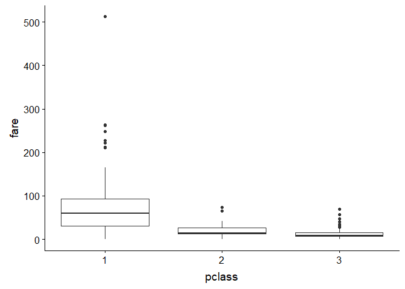

WeTrainOnTestData: Titanic Survivers Classification
================

Things to check
---------------

-   Many age variables are missing which might cause biase | run regression on age and estimate ages of missing values
-   make a dummy vor cabin no cabin | classify different cabin categories
-   

Data Documentation
------------------

<table style="width:100%;">
<colgroup>
<col width="9%" />
<col width="39%" />
<col width="43%" />
<col width="3%" />
<col width="3%" />
</colgroup>
<thead>
<tr class="header">
<th>Variable</th>
<th>Definition</th>
<th>Key</th>
<th></th>
<th></th>
</tr>
</thead>
<tbody>
<tr class="odd">
<td>survival</td>
<td>Survival</td>
<td>0 = No, 1 = Yes</td>
<td></td>
<td></td>
</tr>
<tr class="even">
<td>pclass</td>
<td>Ticket class</td>
<td>1 = 1st, 2 = 2nd, 3 = 3rd</td>
<td></td>
<td></td>
</tr>
<tr class="odd">
<td>sex</td>
<td>Sex</td>
<td></td>
<td></td>
<td></td>
</tr>
<tr class="even">
<td>Age</td>
<td>Age in years</td>
<td></td>
<td></td>
<td></td>
</tr>
<tr class="odd">
<td>sibsp</td>
<td># of siblings / spouses aboard the Titanic</td>
<td></td>
<td></td>
<td></td>
</tr>
<tr class="even">
<td>parch</td>
<td># of parents / children aboard the Titanic</td>
<td></td>
<td></td>
<td></td>
</tr>
<tr class="odd">
<td>ticket</td>
<td>Ticket number</td>
<td></td>
<td></td>
<td></td>
</tr>
<tr class="even">
<td>fare</td>
<td>Passenger fare</td>
<td></td>
<td></td>
<td></td>
</tr>
<tr class="odd">
<td>cabin</td>
<td>Cabin number</td>
<td></td>
<td></td>
<td></td>
</tr>
<tr class="even">
<td>embarked</td>
<td>Port of Embarkation</td>
<td>C = Cherbourg, Q = Queenstown, S = Southampton</td>
<td></td>
<td></td>
</tr>
</tbody>
</table>

Exploratory Data Analysis
-------------------------

Analyse here relationships of variables. z.B Plot of fare and pclass

``` r
describe(Train) %>% kable()
```

    ## Warning in describe(Train): NAs introduced by coercion

    ## Warning in describe(Train): NAs introduced by coercion

    ## Warning in describe(Train): NAs introduced by coercion

    ## Warning in describe(Train): NAs introduced by coercion

    ## Warning in describe(Train): NAs introduced by coercion

    ## Warning in FUN(newX[, i], ...): no non-missing arguments to min; returning
    ## Inf

    ## Warning in FUN(newX[, i], ...): no non-missing arguments to min; returning
    ## Inf

    ## Warning in FUN(newX[, i], ...): no non-missing arguments to min; returning
    ## Inf

    ## Warning in FUN(newX[, i], ...): no non-missing arguments to min; returning
    ## Inf

    ## Warning in FUN(newX[, i], ...): no non-missing arguments to max; returning
    ## -Inf

    ## Warning in FUN(newX[, i], ...): no non-missing arguments to max; returning
    ## -Inf

    ## Warning in FUN(newX[, i], ...): no non-missing arguments to max; returning
    ## -Inf

    ## Warning in FUN(newX[, i], ...): no non-missing arguments to max; returning
    ## -Inf

<table>
<thead>
<tr>
<th style="text-align:left;">
</th>
<th style="text-align:right;">
vars
</th>
<th style="text-align:right;">
n
</th>
<th style="text-align:right;">
mean
</th>
<th style="text-align:right;">
sd
</th>
<th style="text-align:right;">
median
</th>
<th style="text-align:right;">
trimmed
</th>
<th style="text-align:right;">
mad
</th>
<th style="text-align:right;">
min
</th>
<th style="text-align:right;">
max
</th>
<th style="text-align:right;">
range
</th>
<th style="text-align:right;">
skew
</th>
<th style="text-align:right;">
kurtosis
</th>
<th style="text-align:right;">
se
</th>
</tr>
</thead>
<tbody>
<tr>
<td style="text-align:left;">
passengerid
</td>
<td style="text-align:right;">
1
</td>
<td style="text-align:right;">
891
</td>
<td style="text-align:right;">
4.460000e+02
</td>
<td style="text-align:right;">
2.573538e+02
</td>
<td style="text-align:right;">
446.0000
</td>
<td style="text-align:right;">
4.460000e+02
</td>
<td style="text-align:right;">
330.61980
</td>
<td style="text-align:right;">
1.00
</td>
<td style="text-align:right;">
891.0000
</td>
<td style="text-align:right;">
890.0000
</td>
<td style="text-align:right;">
0.0000000
</td>
<td style="text-align:right;">
-1.2040412
</td>
<td style="text-align:right;">
8.621678e+00
</td>
</tr>
<tr>
<td style="text-align:left;">
survived\*
</td>
<td style="text-align:right;">
2
</td>
<td style="text-align:right;">
891
</td>
<td style="text-align:right;">
1.383838e+00
</td>
<td style="text-align:right;">
4.865925e-01
</td>
<td style="text-align:right;">
1.0000
</td>
<td style="text-align:right;">
1.354839e+00
</td>
<td style="text-align:right;">
0.00000
</td>
<td style="text-align:right;">
1.00
</td>
<td style="text-align:right;">
2.0000
</td>
<td style="text-align:right;">
1.0000
</td>
<td style="text-align:right;">
0.4769135
</td>
<td style="text-align:right;">
-1.7745414
</td>
<td style="text-align:right;">
1.630150e-02
</td>
</tr>
<tr>
<td style="text-align:left;">
pclass
</td>
<td style="text-align:right;">
3
</td>
<td style="text-align:right;">
891
</td>
<td style="text-align:right;">
2.308642e+00
</td>
<td style="text-align:right;">
8.360712e-01
</td>
<td style="text-align:right;">
3.0000
</td>
<td style="text-align:right;">
2.385694e+00
</td>
<td style="text-align:right;">
0.00000
</td>
<td style="text-align:right;">
1.00
</td>
<td style="text-align:right;">
3.0000
</td>
<td style="text-align:right;">
2.0000
</td>
<td style="text-align:right;">
-0.6284264
</td>
<td style="text-align:right;">
-1.2834293
</td>
<td style="text-align:right;">
2.800940e-02
</td>
</tr>
<tr>
<td style="text-align:left;">
name\*
</td>
<td style="text-align:right;">
4
</td>
<td style="text-align:right;">
891
</td>
<td style="text-align:right;">
NaN
</td>
<td style="text-align:right;">
NA
</td>
<td style="text-align:right;">
NA
</td>
<td style="text-align:right;">
NaN
</td>
<td style="text-align:right;">
NA
</td>
<td style="text-align:right;">
Inf
</td>
<td style="text-align:right;">
-Inf
</td>
<td style="text-align:right;">
-Inf
</td>
<td style="text-align:right;">
NA
</td>
<td style="text-align:right;">
NA
</td>
<td style="text-align:right;">
NA
</td>
</tr>
<tr>
<td style="text-align:left;">
sex\*
</td>
<td style="text-align:right;">
5
</td>
<td style="text-align:right;">
891
</td>
<td style="text-align:right;">
NaN
</td>
<td style="text-align:right;">
NA
</td>
<td style="text-align:right;">
NA
</td>
<td style="text-align:right;">
NaN
</td>
<td style="text-align:right;">
NA
</td>
<td style="text-align:right;">
Inf
</td>
<td style="text-align:right;">
-Inf
</td>
<td style="text-align:right;">
-Inf
</td>
<td style="text-align:right;">
NA
</td>
<td style="text-align:right;">
NA
</td>
<td style="text-align:right;">
NA
</td>
</tr>
<tr>
<td style="text-align:left;">
age
</td>
<td style="text-align:right;">
6
</td>
<td style="text-align:right;">
714
</td>
<td style="text-align:right;">
2.969912e+01
</td>
<td style="text-align:right;">
1.452650e+01
</td>
<td style="text-align:right;">
28.0000
</td>
<td style="text-align:right;">
2.926923e+01
</td>
<td style="text-align:right;">
13.34340
</td>
<td style="text-align:right;">
0.42
</td>
<td style="text-align:right;">
80.0000
</td>
<td style="text-align:right;">
79.5800
</td>
<td style="text-align:right;">
0.3874744
</td>
<td style="text-align:right;">
0.1597671
</td>
<td style="text-align:right;">
5.436405e-01
</td>
</tr>
<tr>
<td style="text-align:left;">
sibsp
</td>
<td style="text-align:right;">
7
</td>
<td style="text-align:right;">
891
</td>
<td style="text-align:right;">
5.230079e-01
</td>
<td style="text-align:right;">
1.102743e+00
</td>
<td style="text-align:right;">
0.0000
</td>
<td style="text-align:right;">
2.720898e-01
</td>
<td style="text-align:right;">
0.00000
</td>
<td style="text-align:right;">
0.00
</td>
<td style="text-align:right;">
8.0000
</td>
<td style="text-align:right;">
8.0000
</td>
<td style="text-align:right;">
3.6829188
</td>
<td style="text-align:right;">
17.7269083
</td>
<td style="text-align:right;">
3.694330e-02
</td>
</tr>
<tr>
<td style="text-align:left;">
parch
</td>
<td style="text-align:right;">
8
</td>
<td style="text-align:right;">
891
</td>
<td style="text-align:right;">
3.815937e-01
</td>
<td style="text-align:right;">
8.060572e-01
</td>
<td style="text-align:right;">
0.0000
</td>
<td style="text-align:right;">
1.823282e-01
</td>
<td style="text-align:right;">
0.00000
</td>
<td style="text-align:right;">
0.00
</td>
<td style="text-align:right;">
6.0000
</td>
<td style="text-align:right;">
6.0000
</td>
<td style="text-align:right;">
2.7398677
</td>
<td style="text-align:right;">
9.6880847
</td>
<td style="text-align:right;">
2.700390e-02
</td>
</tr>
<tr>
<td style="text-align:left;">
ticket\*
</td>
<td style="text-align:right;">
9
</td>
<td style="text-align:right;">
891
</td>
<td style="text-align:right;">
2.603185e+05
</td>
<td style="text-align:right;">
4.716093e+05
</td>
<td style="text-align:right;">
236171.0000
</td>
<td style="text-align:right;">
1.956829e+05
</td>
<td style="text-align:right;">
185104.09260
</td>
<td style="text-align:right;">
693.00
</td>
<td style="text-align:right;">
3101298.0000
</td>
<td style="text-align:right;">
3100605.0000
</td>
<td style="text-align:right;">
5.2418837
</td>
<td style="text-align:right;">
28.9026995
</td>
<td style="text-align:right;">
1.579950e+04
</td>
</tr>
<tr>
<td style="text-align:left;">
fare
</td>
<td style="text-align:right;">
10
</td>
<td style="text-align:right;">
891
</td>
<td style="text-align:right;">
3.220421e+01
</td>
<td style="text-align:right;">
4.969343e+01
</td>
<td style="text-align:right;">
14.4542
</td>
<td style="text-align:right;">
2.137872e+01
</td>
<td style="text-align:right;">
10.23617
</td>
<td style="text-align:right;">
0.00
</td>
<td style="text-align:right;">
512.3292
</td>
<td style="text-align:right;">
512.3292
</td>
<td style="text-align:right;">
4.7712097
</td>
<td style="text-align:right;">
33.1230682
</td>
<td style="text-align:right;">
1.664792e+00
</td>
</tr>
<tr>
<td style="text-align:left;">
cabin\*
</td>
<td style="text-align:right;">
11
</td>
<td style="text-align:right;">
204
</td>
<td style="text-align:right;">
NaN
</td>
<td style="text-align:right;">
NA
</td>
<td style="text-align:right;">
NA
</td>
<td style="text-align:right;">
NaN
</td>
<td style="text-align:right;">
NA
</td>
<td style="text-align:right;">
Inf
</td>
<td style="text-align:right;">
-Inf
</td>
<td style="text-align:right;">
-Inf
</td>
<td style="text-align:right;">
NA
</td>
<td style="text-align:right;">
NA
</td>
<td style="text-align:right;">
NA
</td>
</tr>
<tr>
<td style="text-align:left;">
embarked\*
</td>
<td style="text-align:right;">
12
</td>
<td style="text-align:right;">
889
</td>
<td style="text-align:right;">
NaN
</td>
<td style="text-align:right;">
NA
</td>
<td style="text-align:right;">
NA
</td>
<td style="text-align:right;">
NaN
</td>
<td style="text-align:right;">
NA
</td>
<td style="text-align:right;">
Inf
</td>
<td style="text-align:right;">
-Inf
</td>
<td style="text-align:right;">
-Inf
</td>
<td style="text-align:right;">
NA
</td>
<td style="text-align:right;">
NA
</td>
<td style="text-align:right;">
NA
</td>
</tr>
<tr>
<td style="text-align:left;">
pclass1
</td>
<td style="text-align:right;">
13
</td>
<td style="text-align:right;">
891
</td>
<td style="text-align:right;">
2.424242e-01
</td>
<td style="text-align:right;">
4.287903e-01
</td>
<td style="text-align:right;">
0.0000
</td>
<td style="text-align:right;">
1.781206e-01
</td>
<td style="text-align:right;">
0.00000
</td>
<td style="text-align:right;">
0.00
</td>
<td style="text-align:right;">
1.0000
</td>
<td style="text-align:right;">
1.0000
</td>
<td style="text-align:right;">
1.2000584
</td>
<td style="text-align:right;">
-0.5604851
</td>
<td style="text-align:right;">
1.436500e-02
</td>
</tr>
<tr>
<td style="text-align:left;">
pclass2
</td>
<td style="text-align:right;">
14
</td>
<td style="text-align:right;">
891
</td>
<td style="text-align:right;">
2.065095e-01
</td>
<td style="text-align:right;">
4.050277e-01
</td>
<td style="text-align:right;">
0.0000
</td>
<td style="text-align:right;">
1.332398e-01
</td>
<td style="text-align:right;">
0.00000
</td>
<td style="text-align:right;">
0.00
</td>
<td style="text-align:right;">
1.0000
</td>
<td style="text-align:right;">
1.0000
</td>
<td style="text-align:right;">
1.4476098
</td>
<td style="text-align:right;">
0.0956854
</td>
<td style="text-align:right;">
1.356890e-02
</td>
</tr>
<tr>
<td style="text-align:left;">
pclass3
</td>
<td style="text-align:right;">
15
</td>
<td style="text-align:right;">
891
</td>
<td style="text-align:right;">
5.510662e-01
</td>
<td style="text-align:right;">
4.976648e-01
</td>
<td style="text-align:right;">
1.0000
</td>
<td style="text-align:right;">
5.638149e-01
</td>
<td style="text-align:right;">
0.00000
</td>
<td style="text-align:right;">
0.00
</td>
<td style="text-align:right;">
1.0000
</td>
<td style="text-align:right;">
1.0000
</td>
<td style="text-align:right;">
-0.2049930
</td>
<td style="text-align:right;">
-1.9601740
</td>
<td style="text-align:right;">
1.667240e-02
</td>
</tr>
</tbody>
</table>
``` r
glimpse(Train)
```

    ## Observations: 891
    ## Variables: 15
    ## $ passengerid <int> 1, 2, 3, 4, 5, 6, 7, 8, 9, 10, 11, 12, 13, 14, 15,...
    ## $ survived    <fct> 0, 1, 1, 1, 0, 0, 0, 0, 1, 1, 1, 1, 0, 0, 0, 1, 0,...
    ## $ pclass      <int> 3, 1, 3, 1, 3, 3, 1, 3, 3, 2, 3, 1, 3, 3, 3, 2, 3,...
    ## $ name        <chr> "Braund, Mr. Owen Harris", "Cumings, Mrs. John Bra...
    ## $ sex         <chr> "male", "female", "female", "female", "male", "mal...
    ## $ age         <dbl> 22, 38, 26, 35, 35, NA, 54, 2, 27, 14, 4, 58, 20, ...
    ## $ sibsp       <int> 1, 1, 0, 1, 0, 0, 0, 3, 0, 1, 1, 0, 0, 1, 0, 0, 4,...
    ## $ parch       <int> 0, 0, 0, 0, 0, 0, 0, 1, 2, 0, 1, 0, 0, 5, 0, 0, 1,...
    ## $ ticket      <chr> "A/5 21171", "PC 17599", "STON/O2. 3101282", "1138...
    ## $ fare        <dbl> 7.2500, 71.2833, 7.9250, 53.1000, 8.0500, 8.4583, ...
    ## $ cabin       <chr> NA, "C85", NA, "C123", NA, NA, "E46", NA, NA, NA, ...
    ## $ embarked    <chr> "S", "C", "S", "S", "S", "Q", "S", "S", "S", "C", ...
    ## $ pclass1     <dbl> 0, 1, 0, 1, 0, 0, 1, 0, 0, 0, 0, 1, 0, 0, 0, 0, 0,...
    ## $ pclass2     <dbl> 0, 0, 0, 0, 0, 0, 0, 0, 0, 1, 0, 0, 0, 0, 0, 1, 0,...
    ## $ pclass3     <dbl> 1, 0, 1, 0, 1, 1, 0, 1, 1, 0, 1, 0, 1, 1, 1, 0, 1,...

``` r
p5
```

    ## NULL

``` r
p6
```



Training Models
---------------

### Random forrest with 10-fold cv

Best model so far Mod3 with accuracy of 0.83.
