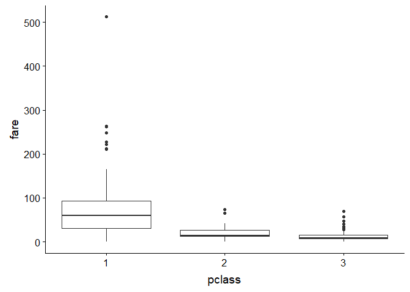

WeTrainOnTestData: Titanic Survivers Classification
================

Intro
-----

Blabla

Exploratory Data Analysis
-------------------------

blablablabla

``` r
glimpse(Train)
```

    ## Observations: 891
    ## Variables: 12
    ## $ passengerid <int> 1, 2, 3, 4, 5, 6, 7, 8, 9, 10, 11, 12, 13, 14, 15,...
    ## $ survived    <fct> 0, 1, 1, 1, 0, 0, 0, 0, 1, 1, 1, 1, 0, 0, 0, 1, 0,...
    ## $ pclass      <int> 3, 1, 3, 1, 3, 3, 1, 3, 3, 2, 3, 1, 3, 3, 3, 2, 3,...
    ## $ name        <chr> "Braund, Mr. Owen Harris", "Cumings, Mrs. John Bra...
    ## $ sex         <chr> "male", "female", "female", "female", "male", "mal...
    ## $ age         <dbl> 22, 38, 26, 35, 35, NA, 54, 2, 27, 14, 4, 58, 20, ...
    ## $ sibsp       <int> 1, 1, 0, 1, 0, 0, 0, 3, 0, 1, 1, 0, 0, 1, 0, 0, 4,...
    ## $ parch       <int> 0, 0, 0, 0, 0, 0, 0, 1, 2, 0, 1, 0, 0, 5, 0, 0, 1,...
    ## $ ticket      <chr> "A/5 21171", "PC 17599", "STON/O2. 3101282", "1138...
    ## $ fare        <dbl> 7.2500, 71.2833, 7.9250, 53.1000, 8.0500, 8.4583, ...
    ## $ cabin       <chr> NA, "C85", NA, "C123", NA, NA, "E46", NA, NA, NA, ...
    ## $ embarked    <chr> "S", "C", "S", "S", "S", "Q", "S", "S", "S", "C", ...

Training Models
---------------

Plot fare and pclass



Note that the `echo = FALSE` parameter was added to the code chunk to prevent printing of the R code that generated the plot. Didel-didel-dumm.
